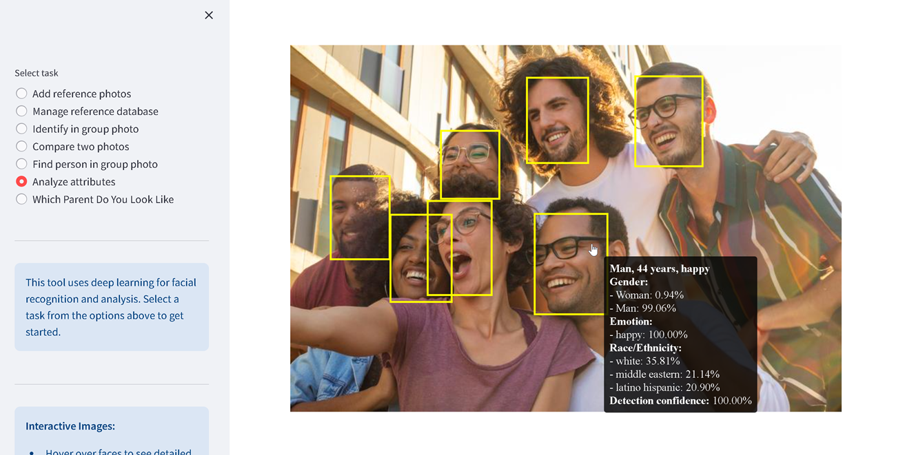

<!-- PROJECT BANNER -->
<h1 align="center">DeepFace Studio</h1>
<p align="center">
  <strong>GPU‑enabled demonstration platform for the <a href="https://github.com/serengil/deepface">DeepFace</a> library</strong><br/>
  
</p>
<p align="center">
  
  
  
  <!-- NEW: CPU‑only DevPod badge -->
  <a href="https://devpod.sh/open#https://github.com/thadius83/deepfacestudio@feature/devcontainer-cpu">
    
  </a>
</p>

---

## Table of Contents
1. [About](#about)  
2. [Features](#features)  
3. [Architecture](#architecture)  
4. [Quick Start (GPU stack)](#quick-start-gpu-stack)  
5. [Dev Containers (VS Code / DevPod)](#dev-containers-vs-code--devpod)  
6. [Configuration](#configuration)  
7. [Using the API](#using-the-api)  
8. [Using the UI](#using-the-ui)  
9. [Development Workflow](#development-workflow)  
10. [Prerequisites](#prerequisites)  
11. [License](#license)  
12. [Acknowledgements](#acknowledgements)

---

## About
**DeepFace Studio** packages DeepFace into a two-container stack:

* **FastAPI service** – exposes verification, identification & attribute-analysis endpoints.  
* **Streamlit UI** – a drag-and-drop web front-end for quick experiments.

It is intended as a **demo / playground** rather than a hardened production system.

---

## Features
* 🔥 **GPU acceleration** through NVIDIA Container Runtime  
* 🖼️ Face *verify*, *find / identify*, *analyze* (age / gender / emotion / race)  
* 🌐 **REST API** documented with Swagger (`/docs`)
* 🪄 **Streamlit UI** with interactive hover effects  
* 💾 Persistent reference database & model weights via Docker volumes  
* ⚡ Opt-in fast rebuilds for development (`BUILD_MODE=dev`)

---

## Architecture

The application consists of two Docker containers that work together:

```
  +------------------+        +------------------+
  |                  |        |                  |
  |   Streamlit UI   |------->|   FastAPI API    |
  |  (localhost:8501)|   HTTP |  (localhost:3900)|
  |                  |   3900 |                  |
  +------------------+        +---------+--------+
                                        |
                                        |
                                        v
                              +---------+--------+
                              |                  |
                              |   Reference DB   |
                              |     (Volume)     |
                              |                  |
                              +------------------+
```

---

## Quick Start (GPU stack)
```bash
# clone & launch
git clone https://github.com/thadius83/deepfacestudio.git
cd deepfacestudio
docker compose up -d --build   # first run downloads model weights

# visit the UI
open http://localhost:8501        # or <CTRL/CMD>-click

# stop & clean
docker compose down
```
> **Note** – Requires an NVIDIA GPU and `nvidia-container-toolkit` for CUDA.

---

## Dev Containers (VS Code / DevPod)

| Variant      | Branch                     | GPU Required | Status         |
| ------------ | -------------------------- | ------------ | -------------- |
| **CPU‑only** | `feature/devcontainer-cpu` | ✘            | ✅ Ready today  |
| **GPU**      | `feature/devcontainer`     | ✔            | 🚧 Coming soon |

### Opening in DevPod (CPU‑only)

Click the **"Open in DevPod"** badge at the top of this README *or* use the URL directly:

```
https://devpod.sh/open#https://github.com/thadius83/deepfacestudio@feature/devcontainer-cpu
```

This launches a container based on the CPU branch with:

* Python 3.10 + all dependencies
* Convenience scripts (`start-api`, `start-ui`)
* Hot‑reloading for both FastAPI and Streamlit
* Persistent volume for reference data and model weights

#### Manual steps (VS Code or DevPod)

```bash
# CPU‑only workflow
git checkout feature/devcontainer-cpu

# open folder in VS Code ↔ Dev Containers extension or DevPod
# and choose "Reopen in Container"
```

---

## Configuration
`backend/app/config.py` centralises tunables.  
Modify and rebuild, or extend the image with environment overrides.

| Variable | Default | Description |
| -------- | ------- | ----------- |
| `MODEL_NAME` | `"Facenet"` | Backbone face-recognition model |
| `DETECTOR_BACKEND` | `"retinaface"` | Face-detector module |
| `IDENTITY_THRESHOLD` | `0.60` | Cosine / Euclidean threshold |
| `REFERENCE_DIR` | `/data/reference_db` | Docker volume mount path |
| `ALLOWED_EXT` | `.jpg .jpeg .png .webp` | Accepted upload types |

---

## Using the API
Swagger docs: `http://localhost:3900/docs`

```bash
# Add reference images for label "Alice"
curl -F "files=@alice1.jpg" -F "files=@alice2.jpg" \
     http://localhost:3900/reference/Alice

# Identify faces in a group photo
curl -F "file=@group.jpg" http://localhost:3900/identify

# Verify two images contain the same person
curl -F "img1=@person1.jpg" -F "img2=@person2.jpg" \
     http://localhost:3900/compare

# Analyze facial attributes
curl -F "file=@portrait.jpg" http://localhost:3900/analyze
```

---

## Using the UI


The Streamlit UI offers seven task types accessible from the sidebar:


Available tasks 

1. **Add reference photos** – Upload one or more images under a name/label
2. **Manage reference database** – View, search, and delete existing references
3. **Identify in group photo** – Find all known faces in a group photo
4. **Compare two photos** – Verify if two images contain the same person
5. **Find person in group photo** – Search for a specific person in a group
6. **Analyze attributes** – Detect age, gender, emotion, and race


   


7. **Which Parent Do You Look Like** – Compare child's face to parents


   


### Identification and Detection


### Interactive Features

The UI includes mouse hover interactions for enhanced UX:
- **Hover over detected faces** to see detailed information pop-ups
- **Green boxes** indicate verified matches to reference database
- **Yellow boxes** indicate detected faces without matches
- **Click expanders** below images to view additional technical details

---

## Development Workflow

### Standard Docker Compose

```bash
# Enable Docker BuildKit cache for rapid iteration
docker compose build --build-arg BUILD_MODE=dev

# Hot-reload API (inside container)
uvicorn backend.app.main:app --reload --host 0.0.0.0 --port 3900

# Hot-reload Streamlit UI
streamlit run ui/streamlit_app.py --server.port 8501 --server.address 0.0.0.0
```

### Dev Container Workflow

```bash
# Start the API server
start-api

# In another terminal, start the UI
start-ui
```

---

## Prerequisites
* **Docker ≥ 20.10** and **Docker Compose v2**  
* For full GPU stack: **NVIDIA GPU**, drivers, and **nvidia-container-toolkit** – see the [installation guide](https://docs.nvidia.com/datacenter/cloud-native/container-toolkit/install-guide.html)
* For Dev Containers: VS Code **Remote-Containers** extension *or* [DevPod](https://devpod.sh)

---

## License
This repository is licensed under the **MIT License** - see [LICENSE](LICENSE) for more details.

DeepFace wraps some external face recognition models: VGG-Face, Facenet (both 128d and 512d), OpenFace, DeepFace, DeepID, ArcFace, Dlib, SFace, GhostFaceNet and Buffalo_L. Besides, age, gender and race/ethnicity models were trained on the backbone of VGG-Face with transfer learning. 

Similarly, DeepFace wraps many face detectors: OpenCv, Ssd, Dlib, MtCnn, Fast MtCnn, RetinaFace, MediaPipe, YuNet, Yolo and CenterFace. Finally, DeepFace is optionally using face anti spoofing to determine the given images are real or fake.

License types will be inherited when you intend to utilize those models. Please check the license types of those models for production purposes.

---

## Acknowledgements
* [**DeepFace**](https://github.com/serengil/deepface) by Sefik & contributors  
* Inspired by numerous Streamlit + FastAPI starter projects  
* Badges courtesy of <https://shields.io>
